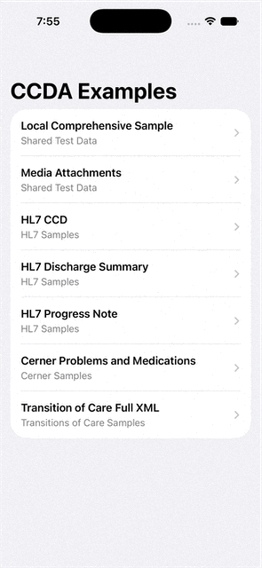
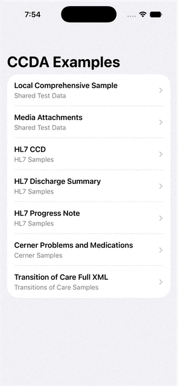

# ccda-kit

`ccda-kit` is an open-source toolkit for parsing C-CDA XML documents into structured models that apps can inspect, transform, and render with native UI.

C-CDA documents can be large, inconsistent, and full of nested clinical sections. This project aims to provide a practical parser layer, shared test data, and platform-native rendering helpers without forcing every app into one UI.

## Previews

  
  

## Goals

- Parse C-CDA XML into stable, typed objects.
- Preserve important clinical document structure: header, patient, sections, entries, coded values, timestamps, and media.
- Keep parser logic separate from UI.
- Support custom rendering by host apps.
- Share test data and expected output across platforms.
- Optimize large documents and embedded media over time.

## Current Status

The first implementations are available for Apple and Android platforms.

Swift Package Manager users should install the generated [`ccda-tools/ccda-swift`](https://github.com/ccda-tools/ccda-swift) distribution. Apple development and pull requests remain in this `ccda-kit` monorepo under `apple/`.

Available Swift products:

- `CCDAEngine`: parser, normalized models, and engine-level errors.
- `CCDAUI`: optional SwiftUI views built on top of `CCDAEngine`.

The Swift package intentionally exposes only these two products. Repository tooling and test-data helpers are not public SwiftPM products.

Platform implementations are developed together in this monorepo. The Apple package and iOS example live under `apple/`; Android source lives under `android/`; future React Native and Flutter packages will own their builds and examples under their respective platform directories.

Supported Apple platforms:

- iOS
- iPadOS through SwiftPM's `.iOS` platform
- macOS

Android modules:

- Native Kotlin parser and model layer
- Jetpack Compose rendering helpers
- Android sample app using shared C-CDA test data

Planned platforms:

- React Native through native iOS and Android bridges
- Flutter through native iOS and Android bridges after React Native

## Guides

- [Apple README](apple/README.md): SwiftPM setup, parsing, XML errors, SwiftUI rendering, example app, and tests.
- [Android README](android/README.md): Gradle setup, parsing and XML errors, Compose rendering, media handling, example app, tests, and packaging.
- [Platform Guide](docs/platform-guide.md): library philosophy, package boundaries, and Apple, Android, React Native, and Flutter direction.
- [Roadmap](docs/roadmap.md): public project direction, milestones, and release priorities.
- [Changelog](CHANGELOG.md): user-facing release history and unreleased changes.
- [Contributing Guide](CONTRIBUTING.md): local development, test expectations, and pull request notes.
- [Security Guide](SECURITY.md): security reporting and PHI handling guidance.
- [Notices](NOTICE.md): sample data sources and healthcare data warnings.

## Testing

The Apple package includes parser behavior tests, XML error tests, public model construction tests, SwiftUI helper tests, shared sample corpus checks, conformance output checks, and parser performance measurements.

The Android project includes Kotlin parser tests, shared sample corpus checks, Compose module compilation, Maven artifact packaging, and an Android sample app build.

Testing and conformance commands are documented in the [Apple README](apple/README.md) and [Android README](android/README.md).

## Versioning And Releases

A tracked snapshot of the Apple package is published to [`ccda-tools/ccda-swift`](https://github.com/ccda-tools/ccda-swift) with semantic version tags so Swift Package Manager can resolve package versions correctly. Android releases are packaged in this monorepo and uploaded to Maven Central for validation and maintainer approval; a separate Android source repository is not required. React Native will publish an npm package, and Flutter will publish through pub.dev directly from their monorepo directories.

Pull requests that change Apple source, the iOS example, shared test data, or `apple/Package.swift` run the Apple package tests and build the example app. Pull requests that change Android source, shared test data, or Android Gradle configuration run Android tests and build the Android sample app. Completed changes can be merged to `main` without publishing a release.

When a release is ready, a maintainer manually runs the central release workflow and selects a patch, minor, or major version bump. That workflow calculates the version once and passes its tag to reusable platform publishers. The Apple publisher updates `ccda-swift`; the Android publisher builds, signs, and uploads Maven artifacts for Central validation and maintainer approval; and the coordinator applies the same tag name to the corresponding `ccda-kit` commit. Future React Native and Flutter publishers will consume the same coordinated version.

Release notes are generated from commits since the previous tag. Human-authored release history should be tracked in [CHANGELOG.md](CHANGELOG.md).

## Important Notes

- This library parses C-CDA XML but does not validate clinical correctness.
- This library does not guarantee regulatory compliance.
- Do not commit protected health information, real patient records, credentials, or production clinical documents.
- Sample files must be public, synthetic, or explicitly approved for test use.

## License

MIT. See [LICENSE](LICENSE).
